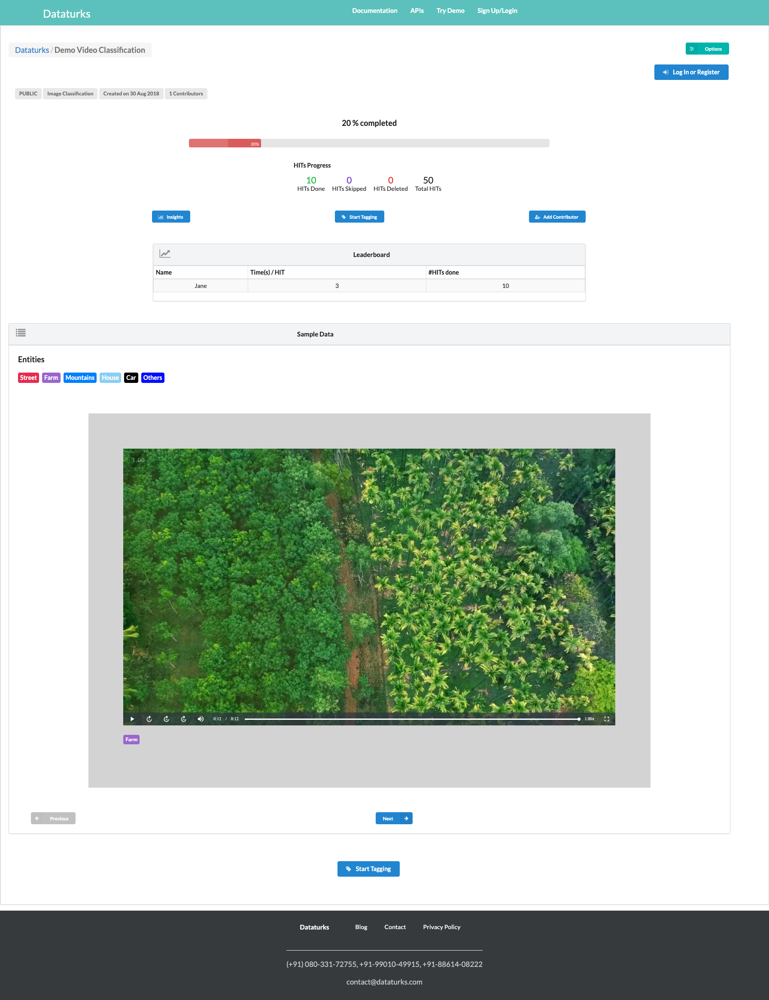

<!--
 * @Author: Azhou
 * @Date: 2021-05-12 16:19:53
 * @LastEditors: Azhou
 * @LastEditTime: 2021-05-12 16:57:03
-->
#### Try Demo

+ 实现所有分类的显示
+ 根据Select Type切换显示
+ 可跳转到 `登录/注册` 页面
+ 可跳转到 `Demo Overview` 页面

#### Demo Overview

+ 实现7个分类的单页面展示
+ 组件可抽离复用
+ option 8个选项功能的实现(有些功能需能登录后才能实现)
+ 可跳转到 `Insights` 页面
+ 可跳转到 `Start Tagging` 页面
+ 实现 Add Contributor

#### Insights

+ 实现数据可视化(echarts)

#### Start Tagging

#### Home

+ 组件可复用 `Demo Overview`
+ 可跳转到 `Create DataSet`
+ 实现 Get API KEY

#### Create DataSet

+ 页面展示可创建的DataSet类型
+ 可跳转到 `create dataset form` 页面

#### Create DataSet Form
